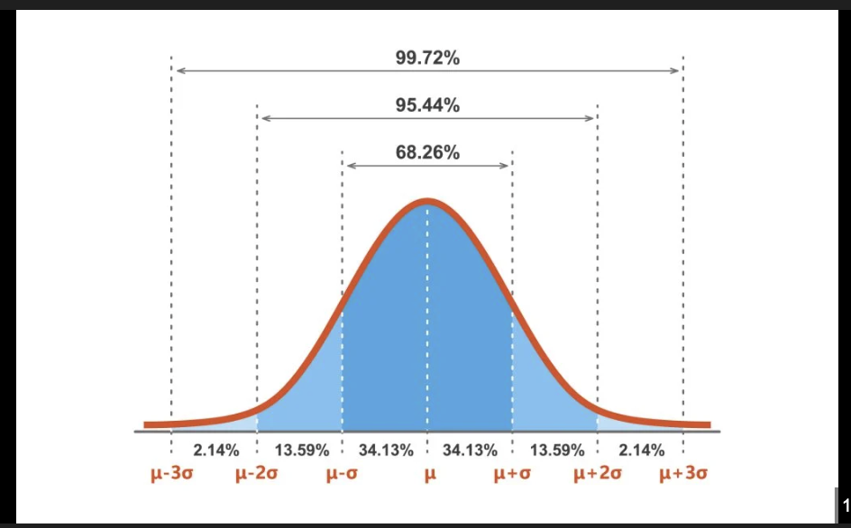
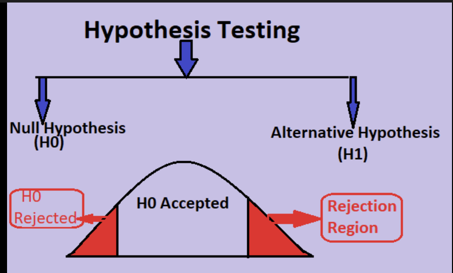

# 📊 Statistics for Machine Learning: The Intuition Guide

**Course**: AI & Machine Learning Bootcamp  
**Module**: 08 - Statistics & Probability  
**Instructor**: Suvom Shaw

---

## 1. Introduction: The Art of Learning from Data

If Linear Algebra is the **Engine** of Machine Learning, Statistics is the **Blueprint**.
It tells us *what* the data looks like, *how* to clean it, and *whether* our results are actually valid.

**Why do we need it?**
*   **Data Cleaning**: How do you fill missing values? (Mean vs Median?)
*   **Feature Selection**: Which features actually matter? (Correlation/P-values)
*   **Model Evaluation**: Is 90% accuracy good? Or just luck?

---

## 2. Module 1: Descriptive Statistics (The "Shape" of Data)

Before we model data, we must describe it.

### 2.1 Types of Data
Models treat different data types differently.

1.  **Quantitative (Numerical)**: Mathematical operations make sense.
    *   **Discrete**: Countable integers (e.g., # of Bedrooms). You can't have 2.5 bedrooms.
    *   **Continuous**: Measurable decimals (e.g., House Price, Height).
2.  **Qualitative (Categorical)**: Labels or categories.
    *   **Nominal**: No order (e.g., Red, Blue, Green). *Must use One-Hot Encoding*.
    *   **Ordinal**: Clear order (e.g., Low < Medium < High). *Must use Label Encoding (0, 1, 2).*

### 2.2 Central Tendency: "Where is the Middle?"

*   **Mean**: The Average. *Sensitive to Outliers*.
    *   **Formula**: $\mu = \frac{\sum x}{N}$
    *   **Calculation**: $[1, 2, 3] \rightarrow \frac{1+2+3}{3} = 2$.
*   **Median**: The Middle Value. *Robust to Outliers*.
    *   **Calculation**: $[1, 5, 20] \rightarrow \text{Sort} \rightarrow [1, 5, 20] \rightarrow 5$.
*   **Mode**: The Most Frequent Value. *Used for Categorical Data*.
    *   **Calculation**: $[A, B, B, C] \rightarrow B$.

> **Analogy: Bill Gates in a Bar**
> Imagine 10 people in a bar, each earning **$50k/year**.
> *   Mean = $50k. Median = $50k.
>
> Now, **Bill Gates** walks in (earning **$100M/year**).
> *   **New Mean**: ~**$9M/year**. (Misleading! Everyone looks like a millionaire).
> *   **New Median**: **$50k/year**. (Still accurate).
>
> **ML Rule**: If your data has outliers (Salaries, House Prices), fill missing values with the **Median**, not the Mean.

### 2.3 Dispersion: "How Spread Out is it?"

*   **Range**: The difference between the maximum and minimum values.
    *   **Formula**: $Max - Min$
    *   **Example**: Prices $[10, 50, 100]$. Range = $100 - 10 = 90$.
    *   *Weakness*: Only uses 2 data points.
*   **Interquartile Range (IQR)**: The spread of the "middle 50%" of data. It is the distance between the 75th percentile ($Q3$) and the 25th percentile ($Q1$).
    *   **Formula**: $IQR = Q3 - Q1$
    *   **Example**: Test scores $[10, 20, \mathbf{30}, 40, 50, \mathbf{60}, 70, 80]$.
        *   $Q1 (25\%) = 30$. $Q3 (75\%) = 60$.
        *   $IQR = 60 - 30 = 30$.
    *   *ML Usage*: **Outlier Removal**. Points outside $1.5 \times IQR$ are considered outliers (Tukey's Rule).
*   **Variance ($\sigma^2$)**: The average squared difference from the mean.
    *   **Formula**: $\sigma^2 = \frac{\sum (x_i - \mu)^2}{N}$
    *   **Calculation**: Data $[2, 6]$. Mean $\mu = 4$.
        *   $(2-4)^2 = (-2)^2 = 4$
        *   $(6-4)^2 = (2)^2 = 4$
        *   Avg $= (4+4)/2 = 4$. Variance = 4.
    *   **The Problem with Variance**: The units are squared (e.g., "Dollars Squared"). This makes it very hard to interpret intuitively. You cannot say "The price varies by 4 dollars squared."
*   **Standard Deviation ($\sigma$)**: The square root of Variance.
    *   **Formula**: $\sigma = \sqrt{\sigma^2}$
    *   **Calculation**: $\sqrt{4} = 2$.
    *   *Interpretation*: "Most data points are within $\pm \sigma$ of the average." It brings the number back to **original units** ($).
    *   **Real ML Usage**:
        1.  **StandardScaler**: We divide by $\sigma$ to scale features to the same range.
        2.  **Confidence Intervals**: We use $\sigma$ to report error margins (e.g., Accuracy $\pm 2\sigma$).

---

## 3. Module 2: Probability & Distributions

A "Distribution" is just a shape that data tends to follow. But first, the basics.

### 3.1 Probability Fundamentals
**Probability $(P)$**: The chance of an event happening (0 to 1).

*   **Independent Events**: Outcome of one does **NOT** affect the other (e.g., Coin Flips).
    *   **Formula**: $P(A \text{ and } B) = P(A) \times P(B)$
    *   **Calculation**: Probability of rolling a 6 AND flipping a Heads.
        *   $P(6) = 1/6$. $P(\text{Heads}) = 1/2$.
        *   $P(\text{Both}) = \frac{1}{6} \times \frac{1}{2} = \frac{1}{12}$.
*   **Dependent Events**: Outcome of one **AFFECTS** the other (e.g., Drawing cards without replacement).
    *   **Formula**: $P(A \text{ and } B) = P(A) \times P(B|A)$
    *   **Calculation**: Drawing 2 Kings from a deck.
        *   Card 1: $P(\text{King}_1) = 4/52$.
        *   Card 2 (One King is gone!): $P(\text{King}_2) = 3/51$.
        *   $P(\text{Both}) = \frac{4}{52} \times \frac{3}{51} \approx 0.0045$.

### 3.2 Bayes' Theorem 
Describes the probability of an event, based on prior knowledge.

**Formula**:
$$ P(A|B) = \frac{P(B|A) \cdot P(A)}{P(B)} $$

*   $P(A|B)$: Posterior (Probability of Hypothesis A given Evidence B).
*   $P(B|A)$: Likelihood (Probability of Evidence B given Hypothesis A is true).
*   $P(A)$: Prior (Initial probability of Hypothesis A).
*   $P(B)$: Evidence (Total probability of Evidence B).

### 3.2.1 Bayes' Theorem Examples (Detailed Walkthrough)

**Example 1: The "Cancer Test" Paradox (Medical Diagnosis)**
*   **The Breakdown**:
    *   **Event A**: Patient has Cancer. ($P(A) = 0.01$)
    *   **Event B**: Test is Positive.
    *   **$P(B|A)$ (Likelihood)**: Probability of Positive Test GIVEN Patient has Cancer. ($0.99$)
    *   **$P(A|B)$ (Posterior)**: Probability Patient has Cancer GIVEN Test is Positive. (This is what we want).
*   **The Problem**:
    *   A rare disease affects only **1%** of the population.
    *   A test is **99% accurate** (Sensitivity).
    *   **Question**: You take the test and it comes back **Positive**. What is the chance you *actually* have the disease?
*   **The Math**:
    $$ P(A|B) = \frac{P(B|A) \cdot P(A)}{P(B)} = \frac{0.99 \times 0.01}{(0.99 \times 0.01) + (0.01 \times 0.99)} = 0.5 $$
*   **The Intuition**:
    *   Imagine **1,000 people**.
    *   **10 are Sick** (1%). The test correctly flags **~10** of them as Positive.
    *   **990 are Healthy** (99%). The test makes a mistake on 1% of them, so **~10** healthy people get a False Positive.
    *   So, out of the **20 positive results**, only **10 are real**. That is exactly **50%**.

**Example 2: The Spam Filter (Email Classification)**
*   **The Breakdown**:
    *   **Event A**: Email is Spam. ($P(A) = 0.2$)
    *   **Event B**: Email contains the word "Free".
    *   **$P(B|A)$ (Likelihood)**: Probability of "Free" GIVEN Email is Spam. ($0.90$)
    *   **$P(A|B)$ (Posterior)**: Probability Email is Spam GIVEN it contains "Free".
*   **The Problem**:
    *   **20%** of all emails are Spam.
    *   If an email is Spam, there is a **90%** chance it contains the word "Free".
    *   If an email is NOT Spam (Ham), there is only a **5%** chance it contains "Free".
    *   **Question**: An email arrives with the word "Free". Is it Spam?
*   **The Math**:
    $$ P(A|B) = \frac{0.9 \times 0.2}{(0.9 \times 0.2) + (0.05 \times 0.8)} = \frac{0.18}{0.22} \approx 81.8\% $$
*   **The Intuition**:
    *   Before looking at the content, we assume only a 20% chance of Spam.
    *   The word "Free" is **strong evidence**: it is 18 times more likely to appear in Spam (90%) than in Ham (5%).
    *   This strong evidence pushes our belief from 20% all the way up to **81.8%**.

**Example 3: The Defective Factory (Root Cause Analysis)**
*   **The Breakdown**:
    *   **Event A**: Part came from Machine A. ($P(A) = 0.3$)
    *   **Event B**: Part is Defective.
    *   **$P(B|A)$ (Likelihood)**: Probability Part is Defective GIVEN it came from Machine A. ($0.01$)
    *   **$P(A|B)$ (Posterior)**: Probability Part came from Machine A GIVEN it is Defective.
*   **The Problem**:
    *   **Machine A** produces **30%** of total parts. It is very reliable (**1% defect rate**).
    *   **Machine B** produces **70%** of total parts. It is older and less reliable (**5% defect rate**).
    *   **Question**: You find a **Defective Part** in the bin. What is the probability it came from Machine A?
*   **The Math**:
    $$ P(A|B) = \frac{0.01 \times 0.3}{(0.01 \times 0.3) + (0.05 \times 0.7)} = \frac{0.003}{0.038} \approx 7.9\% $$
*   **The Intuition**:
    *   Machine B makes **more parts** (70% vs 30%).
    *   Machine B **breaks more often** (5% vs 1%).
    *   So, the pile of defective parts is dominated by Machine B. Even though Machine A contributed to the pile, its contribution is tiny. If you find a broken part, it is **overwhelmingly likely (92.1%)** to be from Machine B.

### 3.3 Discrete Distributions (Countable Events)
These describe events with distinct outcomes (Integers).

**1. Bernoulli Distribution (The Coin Flip)**

*   **Definition**: A single trial with only 2 outcomes: Success ($p$) or Failure ($1-p$).
*   **Example**: Will a user click an Ad? (Yes/No).
*   **Diagram**:

**2. Poisson Distribution (The Call Center)**
*   **Definition**: Probability of a number of events occurring in a fixed interval of time.
*   **Example**: How many emails do you get per hour? (0, 5, 100...). *Rare events*.
*   **Key Parameter ($\lambda$)**: The average rate (e.g., 5 emails/hour).

---

---

### 3.4 Continuous Distributions (The Normal Family)
These describe measurable values (Decimals).

**1. The Normal Distribution (Gaussian)**
*   **Definition**: The classic "Bell Curve". Symmetric around the Mean ($\mu$).
*   **Parameters**: Mean ($\mu$) determines the center. Std Dev ($\sigma$) determines the width.
*   **Real World**: Heights, IQ Scores, Measurement Errors.

**2. The Standard Normal Distribution (Z-Distribution)**
*   **Definition**: A special Normal Distribution where $\mu = 0$ and $\sigma = 1$.
*   **Why convert to it?**: To compare different datasets (e.g., SAT vs ACT scores).
*   **Transformation**: $Z = \frac{x - \mu}{\sigma}$.

**3. The Empirical Rule (68-95-99.7 Rule)**
*   **Concept**: For ANY Normal Distribution:
    *   **68%** of data falls within $\mu \pm 1\sigma$.
    *   **95%** of data falls within $\mu \pm 2\sigma$.
    *   **99.7%** of data falls within $\mu \pm 3\sigma$.
    
*   **Diagram (Visualizing the Spread)**:

*(Note: Visual representation of coverage width)*

*   **Application Example**:
    *   **Scenario**: Factory produces bolts with Mean Diameter = 10mm, Std Dev = 0.2mm.
    *   **Question**: What range do 95% of bolts fall into?
    *   **Calculation**:
        *   Range = $\mu \pm 2\sigma$
        *   Lower = $10 - (2 \times 0.2) = 10 - 0.4 = 9.6$mm.
        *   Upper = $10 + (2 \times 0.2) = 10 + 0.4 = 10.4$mm.
    *   **Conclusion**: 95% of bolts are between **9.6mm and 10.4mm**. Any bolt outside this is considered an "Outlier" or "Defect".

---

## 4. Module 3: Inferential Statistics (Hypothesis Testing)

This is how we prove things scientifically.

### 4.1 The Concept: "Is this Coin Real?" (Hypothesis Testing)
Hypothesis testing is just a way to check if a result is **real** or just **pure luck**.

**The Scenario**:
Your friend gives you a coin. You suspect it's a **Trick Coin** (always lands on Heads).
How do you prove it? You **assume it's normal** and see if the results are "too weird" to be true.

**Step 1: The Boring Assumption (Null Hypothesis $H_0$)**
*   "This is just a normal, fair coin." ($P(Heads) = 0.5$).

**Step 2: The Bold Claim (Alternative Hypothesis $H_1$)**
*   "No! This is a TRICK coin." ($P(Heads) > 0.5$).

**Step 3: The Test (Collect Data)**
*   You flip the coin **5 times**.
*   **Result**: It lands on **Heads 5 times in a row**.

**Step 4: The "Surprise Score" (P-Value)**
*   If the coin *was* fair ($H_0$ is true), what is the chance of getting 5 Heads?
*   Analysis: $(1/2) \times (1/2) \times (1/2) \times (1/2) \times (1/2) = 1/32 \approx \mathbf{0.03} (3\%)$.
*   This 3% probability is the **P-Value**.

**Step 5: The Decision**
*   **The Rule (Significance Level $\alpha$)**: Usually, if the chance is **less than 5% (0.05)**, we say "This is too weird to be luck."
*   **Conclusion**: Since $0.03 < 0.05$, we **Reject the Null Hypothesis**.
*   **Conclusion**: Since $0.03 < 0.05$, we **Reject the Null Hypothesis**.
*   It is extremely unlikely to be a fair coin. It is likely a **Trick Coin**.

---

---

### 4.2 Deep Dive: What is a P-Value? (The "Surprise Factor")
A P-Value is not a "magic truth number". It is a **Measure of Surprise**.

*   **Definition**: The probability that you would see these results *purely by chance*, if the boring assumption ($H_0$) were true.
*   **High P-Value (e.g., 0.80)**: "I am **NOT surprised**. This could easily happen by luck." $\rightarrow$ **Fail to Reject Null**.
*   **Low P-Value (e.g., 0.01)**: "I am **SHOCKED**. This almost never happens by luck." $\rightarrow$ **Reject Null**.

#### The "Pizza Delivery" Analogy
*   **Scenario**: A pizza shop claims "We always deliver in 30 mins or less" ($H_0$: Delivery Time $\le$ 30).
*   **Evidence 1**: One pizza takes 31 minutes.
    *   **Reaction**: "Meh. Traffic happens."
    *   **P-Value**: **0.40** (Not surprising. Could be luck).
*   **Evidence 2**: You order 5 pizzas over a month. **All 5 take > 1 hour**.
    *   **Reaction**: "Okay, this is NOT traffic. You guys are lying."
    *   **P-Value**: **0.0001** (Extremely surprising).
*   **Conclusion**: You **Reject** their claim. The evidence is too strong to be random chance.

---

### 4.3 Real-World Examples

#### Example 1: The Web Design A/B Test
*   **Scenario**: You change the "Buy Now" button from **Blue** to **Red**.
*   **$H_0$**: The Red button has the **Same** click rate as the Blue button.
*   **$H_1$**: The Red button is **Different** (Better or Worse).
*   **Result**: P-value = 0.03.
*   **Conclusion**: Since 0.03 < 0.05, we **Reject Null**. The Red button statistically changed user behavior.

#### Example 2: The Headache Pill Test (New Medicine)
*   **Scenario**: A company invents a new pill, "Super-Aspirin". Does it cure headaches faster than a Sugar Pill (Placebo)?
*   **$H_0$ (Boring Assumption)**: Super-Aspirin is **Fake news**. It works exactly the same as sugar. (No Effect).
*   **$H_1$ (Bold Claim)**: Super-Aspirin **actually works**. It cures headaches faster than sugar.
*   **The Test**: You give it to 100 people.
*   **Result (P-Value)**: 0.12 (12%).
*   **Conclusion**: Since 12% > 5% (Significance Level), we **Fail to Reject Null**.
    *   *Translation*: The results are not impressive enough. It could just be luck. The FDA will **NOT** approve this drug.

#### Example 3: Compare Two AI Models (Is the new model better?)
*   **Scenario**: Your current AI model has **85% accuracy**. You train a **New Model** and it gets **87% accuracy** on the test set.
*   **Question**: Is the new model *actually* better, or did you just get lucky with the easy test questions?
*   **$H_0$ (The Skeptic)**: The New Model is **the same** as the Old Model (Accuracy = 85%). Ideally, the improvements are just noise.
*   **$H_1$ (The Optimist)**: The New Model is **better** (Accuracy > 85%).
*   **Result**: P-value = 0.04.
*   **Conclusion**: Since 0.04 < 0.05, we **Reject Null**. The improvement is statistically significant. Ship the new model!

---

## 5. Summary Cheat Sheet

| Statistical Concept | The "English" Translation | Machine Learning Role |
| :--- | :--- | :--- |
| **Mean vs Median** | Average vs Middle | Imputation (Use Median for outliers) |
| **Standard Deviation** | "How wobbly is the data?" | Feature Scaling (StandardScaler) |
| **Normal Distribution** | The Bell Curve | Assumption for Linear Regression |
| **P-Value** | "Surprise Factor" | Feature Selection (Keep low p-value features) |
| **Hypothesis Test** | "Is this real or luck?" | A/B Testing, Model Comparison |
| **Correlation** | "Do they move together?" | Drop redundant features if Correlation > 0.9 |
