# MCP and Modern Agentic Systems

These notes explain how modern AI agents are built when they need to do real work with tools, files, databases, browsers, APIs, memory, approvals, and evaluation.

The core idea is simple:

> A production agent is not just a prompt. It is a software system around a model.

---

## 1. Why Modern Agent Design Changed

Early LLM applications were often built like this:

```text
User asks question -> Prompt -> LLM -> Text answer
```

That is enough for simple question answering. It is not enough when the system must:

- search real documents
- read or write files
- call APIs
- query a database
- use a browser
- remember useful information
- ask for approval before risky actions
- produce structured output
- log what happened
- recover from failures
- prove quality with evaluation

A modern agent has to combine reasoning with software engineering discipline.

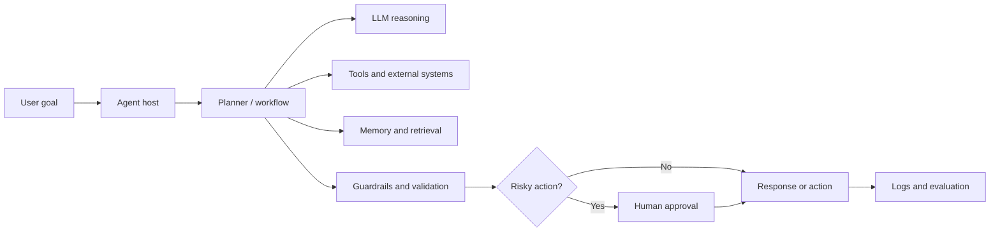

In a real project, the LLM is only one part of the design. The surrounding system decides what the model can access, how actions are validated, what gets logged, and what requires human review.

---

## 2. What Is MCP?

**MCP** stands for **Model Context Protocol**.

It is a standard protocol that lets AI applications connect to external tools and context through reusable servers.

Instead of writing one custom integration for every tool in every AI app, MCP gives a common shape:

```text
Host app <-> MCP client <-> MCP server <-> external capability
```

The external capability could be:

- a local file system
- a database
- a documentation source
- a browser
- a ticketing system
- a cloud API
- a code search tool
- an internal business system

### Simple Analogy

Think of MCP as a plug standard.

Without a standard:

```text
App A needs custom database integration
App B needs another custom database integration
App C needs another custom database integration
```

With MCP:

```text
Database MCP server exposes the database once
Many host apps can connect to it through the same protocol
```

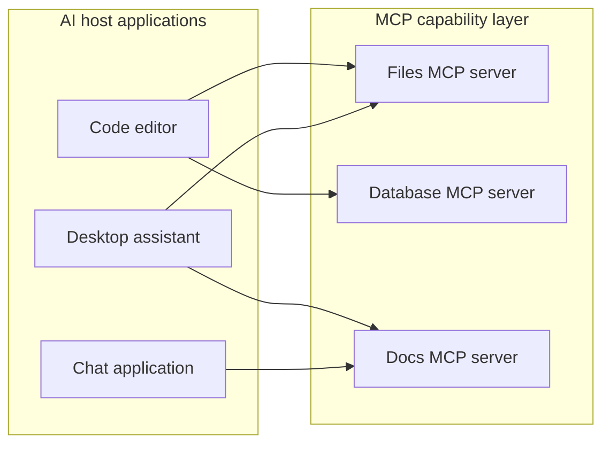

MCP does **not** make the model smarter by itself. It standardizes how capabilities are exposed to the host application.

---

## 3. Main MCP Components

| Component | Meaning | Example |
|---|---|---|
| Host | The application where the user interacts with the agent | IDE, chat app, desktop agent |
| Model | The LLM that reasons and decides what may help | GPT, Claude, local LLM |
| MCP client | The host-side connector that speaks MCP | Client inside the IDE or app |
| MCP server | A program exposing tools, resources, or prompts | Files server, database server |
| Tool | A callable action with a name, description, and input schema | `search_docs(query)` |
| Resource | Context that can be read by the host/model | file, doc, table, page |
| Prompt | A reusable prompt template exposed by a server | "summarize incident report" |

The model does not directly control the operating system. The host decides which MCP servers are available, which tool calls are allowed, and whether a human must approve an action.

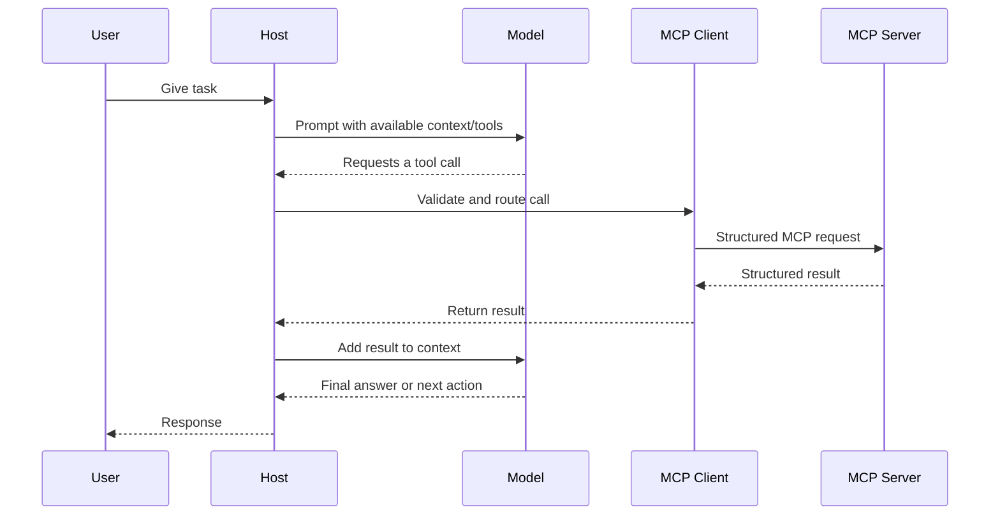

Important design point:

> MCP standardizes access. It does not replace permission design, workflow control, guardrails, or evaluation.

---

## 4. What Problem MCP Solves

Before MCP, tool integrations were often tightly coupled to one application.

Example:

```text
Custom IDE agent -> custom file reader
Custom chatbot   -> custom file reader
Custom dashboard -> custom file reader
```

Each project repeated the same integration work.

MCP improves this by separating:

- the **host**, where the agent runs
- the **capability**, exposed by an MCP server
- the **protocol**, used to communicate between them

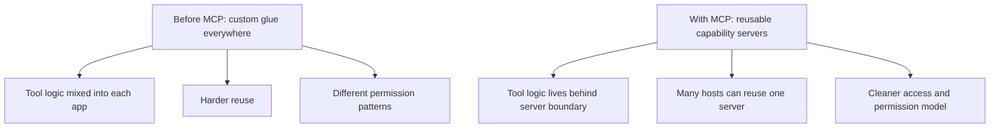

This matters more as systems grow. A small demo might have two tools. A real assistant inside a company may need dozens of tools across files, databases, APIs, browser automation, documentation, and internal services.

---

## 5. MCP vs Tool Calling vs LangGraph

These terms are often confused because they can appear in the same agent project. They solve different problems.

| Concept | Main job | Best for |
|---|---|---|
| Plain tool calling | Let the model call functions directly inside one app | Small apps with a few fixed tools |
| MCP | Standardize access to tools/resources across hosts | Reusable integrations and cleaner boundaries |
| LangGraph | Control workflow, state, routing, retries, and human interrupts | Multi-step deterministic agent flows |
| RAG | Retrieve relevant knowledge before answering | Knowledge-grounded question answering |
| Guardrails | Validate allowed behavior and output format | Safety, policy, schema, and risk control |
| Evaluation | Measure quality and failure patterns | Production reliability |

### How They Work Together

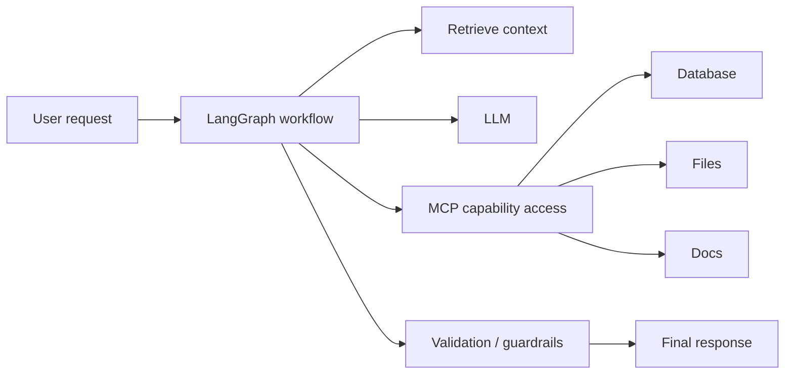

One possible production design:

- LangGraph decides the flow.
- RAG provides relevant documents.
- MCP exposes reusable tools and resources.
- The LLM reasons over the task and tool results.
- Guardrails validate what the system is allowed to do.
- Evaluation checks whether the whole system works.

### Short Memory Hook

```text
LangGraph controls the journey.
MCP provides access to capabilities.
RAG supplies knowledge.
Guardrails check safety.
Evaluation proves reliability.
```

---

## 6. Production Agent Building Blocks

A production agent usually needs more than a model and a few functions.

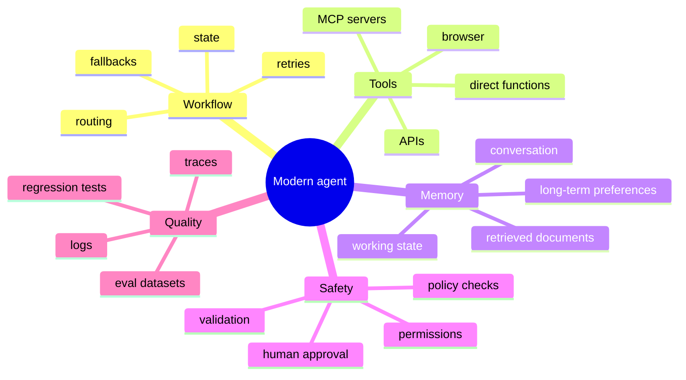

### 6.1 Workflow and Orchestration

Workflow decides what happens first, second, and third.

A weak design:

```text
One giant prompt decides everything
```

A stronger design:

```text
Route task -> retrieve context -> choose action -> validate -> execute -> evaluate -> respond
```

Workflow matters because agents often need predictable behavior. For example, a refund assistant should not decide randomly whether to check policy, inspect the order, or ask for approval. The steps should be explicit.

### 6.2 Tools

Tools let the agent act outside the model.

Examples:

- `search_docs(query)`
- `read_file(path)`
- `query_customer_db(customer_id)`
- `create_ticket(title, body)`
- `send_email(to, subject, body)`
- `open_browser(url)`

Every tool should have:

- a clear name
- a precise description
- a schema for inputs
- predictable outputs
- permission boundaries
- error handling

Bad tool descriptions cause bad tool calls. A tool called `process_data` is vague. A tool called `summarize_sales_csv(file_path, group_by, metric)` is much easier for the model to use correctly.

### 6.3 Memory

Memory is information the agent can use beyond the current sentence.

| Memory type | Meaning | Example |
|---|---|---|
| Conversation memory | Recent messages in the current chat | "The user asked about MCP" |
| Working memory | Temporary task state | "We already checked these 3 files" |
| Long-term memory | Stable preferences or repeated facts | "Prefer notebook outputs cleared" |
| Vector memory / retrieval | Searchable document chunks | "Retrieve policy section about refunds" |

Memory should be useful and intentional. Do not store everything.

Good memory candidates:

- stable user preferences
- project conventions
- repeated decisions
- durable facts that will help future tasks

Poor memory candidates:

- sensitive secrets
- one-time noisy details
- unverified assumptions
- temporary errors that are no longer true

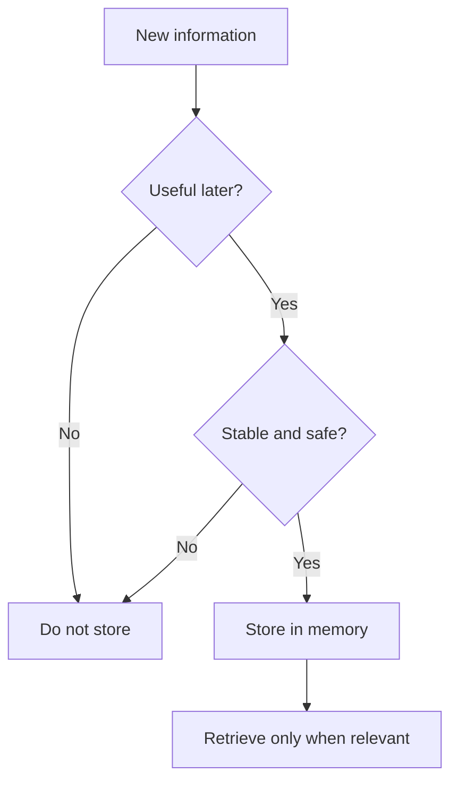

### 6.4 Structured Output

Text is flexible, but software often needs predictable structure.

Instead of:

```text
I think this should be approved because the order is eligible.
```

Use:

```json
{
  "decision": "approve",
  "reason": "order is within refund window",
  "requires_human_review": false
}
```

Structured output is important when the agent result is consumed by another system.

### 6.5 Human Approval

Some actions should not be fully automated.

Require approval for:

- deleting files
- sending emails externally
- spending money
- issuing refunds
- changing production data
- calling a customer
- publishing content
- modifying access control

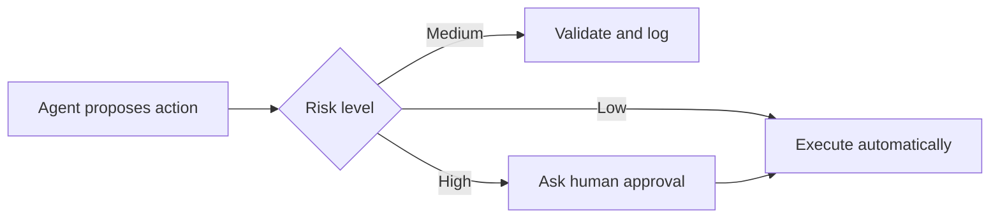

Good production design lets agents prepare risky work, but humans approve the final step.

### 6.6 Guardrails

Guardrails check whether an input, output, or action is allowed.

Examples:

- validate JSON schema
- block unsafe instructions
- restrict which files can be read
- reject tool calls outside allowed domains
- check whether a requested action needs approval
- verify that an answer cites retrieved sources

Guardrails are not only about safety. They also improve reliability by catching malformed outputs and invalid tool arguments.

### 6.7 Observability and Evaluation

If an agent fails, you need to know why.

Observability answers:

- What did the user ask?
- What context was retrieved?
- Which tools were called?
- What arguments were used?
- What did each tool return?
- Where did validation fail?
- What final answer was produced?

Evaluation answers:

- Did the agent solve the task?
- Did it use the correct tool?
- Did it follow policy?
- Did it avoid hallucinating?
- Did it ask for approval when required?
- Did a recent change make performance worse?

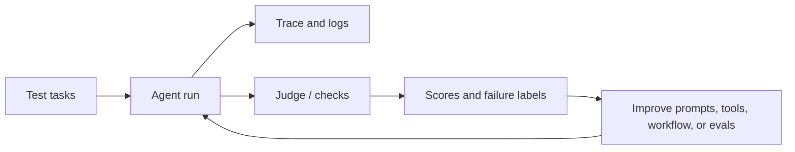

---

## 7. Example: Customer Support Agent

Imagine a customer support assistant that can answer order questions and create support tickets.

### Available Capabilities

| Capability | Possible implementation |
|---|---|
| Search help center | RAG or docs MCP server |
| Look up order | Database MCP server |
| Create ticket | Direct API tool or MCP server |
| Send email | Tool requiring approval |
| Remember preference | Long-term memory |
| Refund customer | High-risk tool with human approval |

### Architecture

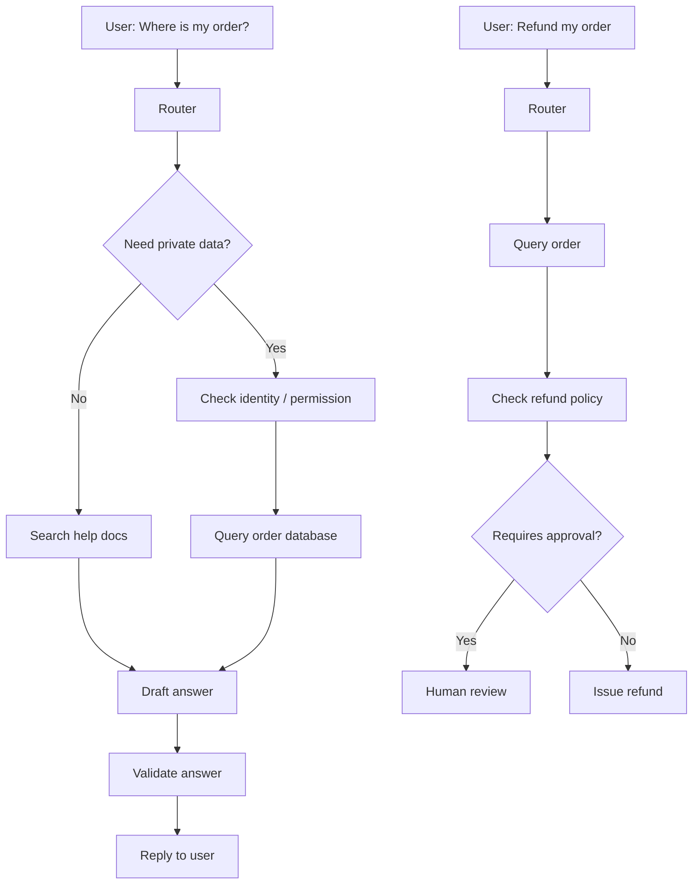

### Design Decisions

- Use RAG for public support documentation.
- Use an MCP database server if many host apps need the same order lookup.
- Use workflow control for identity checks and refund policy steps.
- Use human approval for refunds above a threshold.
- Log all database reads and refund attempts.
- Evaluate on realistic support conversations, not only happy paths.

This is the difference between a demo chatbot and a production support agent.

---

## 8. Example: Code Assistant With MCP

A coding assistant may need to:

- search files
- inspect symbols
- run tests
- read documentation
- open a browser
- create a patch
- ask before destructive changes

MCP can expose file search, docs search, database introspection, or browser tools in a standardized way.

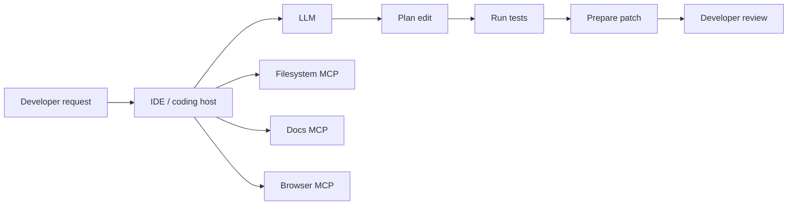

Important: even with MCP, the assistant still needs good engineering behavior:

- read the existing code first
- keep edits scoped
- run relevant tests
- explain what changed
- avoid destructive commands unless clearly approved

MCP gives access to capabilities. It does not replace judgment.

---

## 9. Hands-On: Minimal MCP Server Concept

An MCP server exposes tools. A tiny server might expose two tools:

```python
from mcp.server.fastmcp import FastMCP

mcp = FastMCP("demo")

@mcp.tool()
def add(a: int, b: int) -> int:
    """Add two numbers."""
    return a + b

@mcp.tool()
def word_count(text: str) -> int:
    """Count words in text."""
    return len(text.split())

if __name__ == "__main__":
    mcp.run()
```

The host can discover that the server has tools named `add` and `word_count`. When the user asks for a task, the model may request one of those tools. The host validates and sends the structured request to the server.

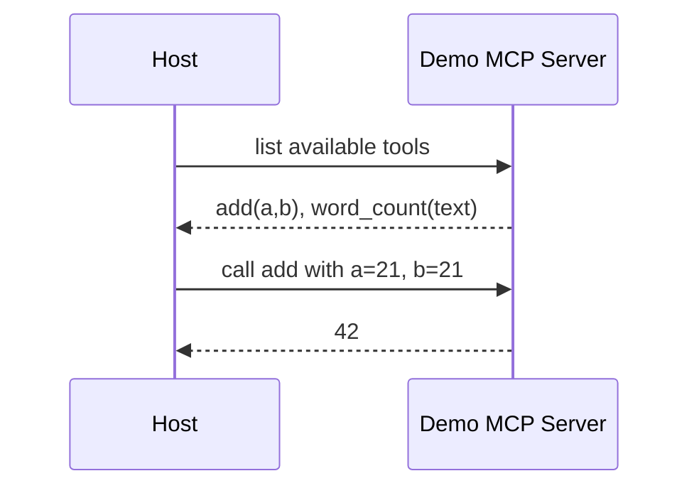

### What the Tool Schema Does

The schema tells the host/model what arguments are valid.

For `add(a: int, b: int)`, the schema is effectively:

```json
{
  "type": "object",
  "properties": {
    "a": {"type": "integer"},
    "b": {"type": "integer"}
  },
  "required": ["a", "b"]
}
```

This reduces ambiguity. The model should not call `add` with `"twenty one"` unless the schema allows a string.

---

## 10. Where MCP Is Useful

Use MCP when:

- multiple applications need the same capability
- the tool boundary should be clean and reusable
- permissions matter
- the capability has its own lifecycle
- the system is growing beyond a few local functions
- a team wants standardized integrations
- the same files, docs, databases, or APIs should be exposed to different agent hosts

Good MCP candidates:

- internal documentation search
- database query service
- codebase search
- browser automation
- ticketing system integration
- CRM integration
- local file access
- analytics query layer

---

## 11. Where MCP May Be Overkill

Skip MCP when:

- the app is a tiny prototype
- there are only one or two local functions
- no other host needs the tools
- direct function calls are simpler and safer
- the team does not need a reusable capability server yet

Example:

```text
Small script:
  read one CSV -> summarize rows -> print output

Better choice:
  direct Python function calls

MCP would add setup and protocol overhead without much benefit.
```

MCP is valuable when the integration boundary matters. It is not mandatory for every agent.

---
