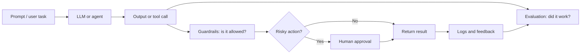
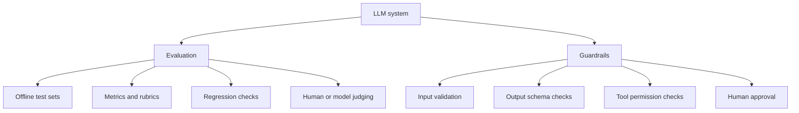
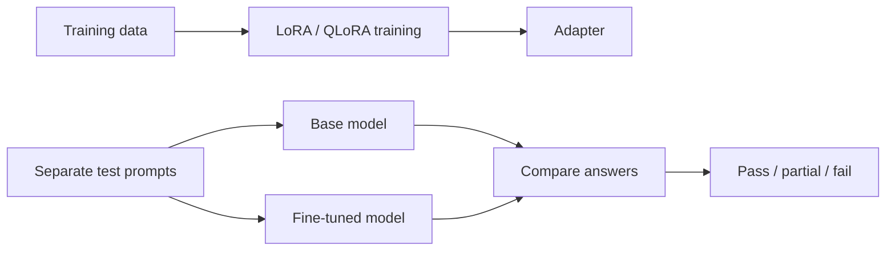
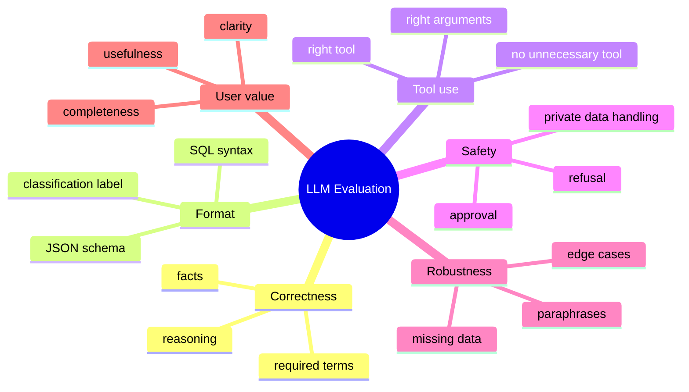
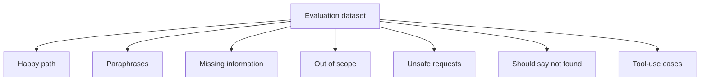
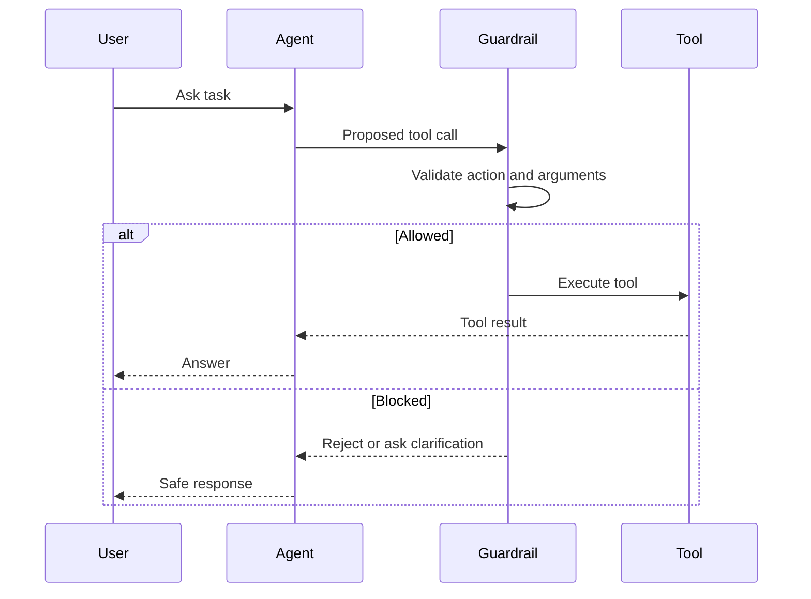
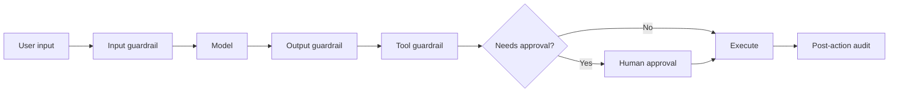
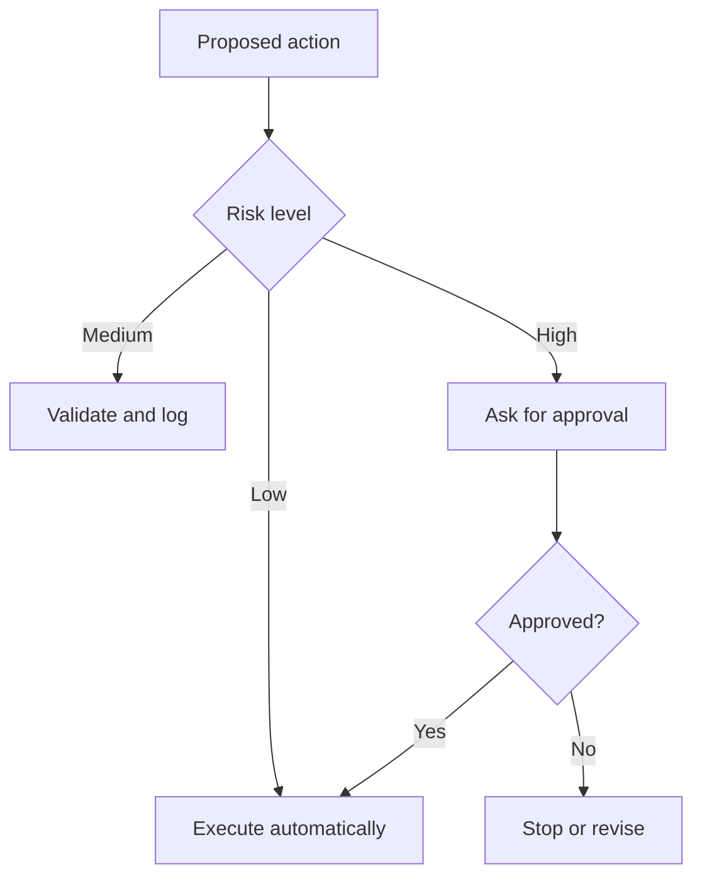
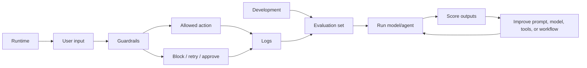
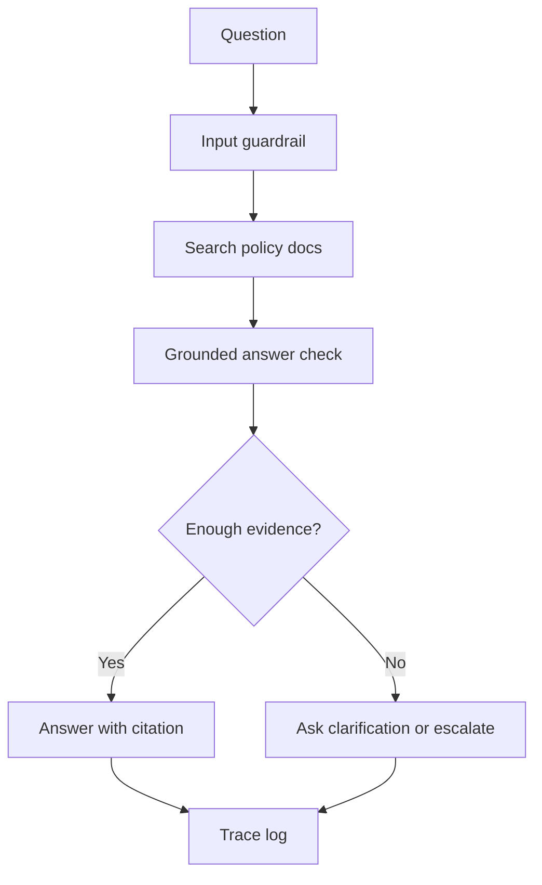

# LLM Evaluation and Guardrails

These notes explain how to measure the quality of LLM systems and how to control risky behavior when models use tools, structured outputs, memory, or fine-tuned adapters.

The central idea:

> Evaluation asks, "Did the system work?"  
> Guardrails ask, "Should this input, output, or action be allowed?"

Both are required for production-ready LLM applications.

---

## 1. Why Evaluation and Guardrails Matter

A demo can look impressive even when the system is weak.

An LLM app may produce fluent text but still fail in important ways:

- the answer sounds confident but is factually wrong
- the JSON output is invalid
- the model calls the wrong tool
- the tool arguments are missing required fields
- the agent performs an unsafe action
- the fine-tuned model memorizes training examples but fails on new prompts
- nobody can debug the failure because no trace was logged

Production LLM systems need a design that combines quality measurement and runtime control.



Evaluation and guardrails are not optional extras. They are the difference between a nice demo and a reliable system.

---

## 2. Simple Definitions

### Evaluation

Evaluation means testing an LLM system against expected behavior.

It answers questions like:

- Is the answer correct?
- Is the response complete?
- Is the output format valid?
- Did the fine-tuned model improve over the base model?
- Did the agent choose the correct tool?
- Did the system handle edge cases?
- Did the behavior remain stable after a code or prompt change?

Evaluation can happen before release, during development, after model updates, and continuously in production.

### Guardrails

Guardrails are rules, checks, validations, and approval controls that reduce unsafe or incorrect behavior.

They answer questions like:

- Is this input allowed?
- Is the output valid?
- Is the requested action safe?
- Are the tool arguments valid?
- Does this action require approval?
- Should the system block, retry, ask a question, or escalate?

Guardrails usually run at runtime, while the system is operating.

---

## 3. Evaluation vs Guardrails

Evaluation and guardrails are related, but they solve different problems.

| Question | Evaluation | Guardrail |
|---|---|---|
| Did the model answer correctly? | Yes | Sometimes |
| Should this tool call be allowed? | No | Yes |
| Is JSON valid? | Yes, in tests | Yes, at runtime |
| Did a prompt change improve quality? | Yes | No |
| Should a refund be approved automatically? | No | Yes |
| Did the system regress after deployment? | Yes | Sometimes |

Short version:

```text
Evaluation measures quality.
Guardrails control behavior.
```



---

## 4. Bridge From LoRA to Evaluation

Fine-tuning with LoRA or QLoRA changes model behavior. But a completed training run does not prove the model is better.

After fine-tuning, ask:

```text
Did the adapted model improve on unseen examples?
Did it still behave well outside the target task?
Did it reduce the specific failures we cared about?
```

Do not evaluate only on training examples. Passing a training example may only show memorization.



### Why Separate Test Prompts Matter

If a model saw the exact question during training, success is weak evidence.

Better evaluation uses:

- prompts not present in training
- different wording for the same task
- malformed or incomplete inputs
- unrelated prompts to check over-adaptation
- realistic examples from the target workflow

---

## 5. Mini LoRA Evaluation Example

Suppose a model was fine-tuned to generate SQL for a private company schema.

The base model may know generic SQL, but not private table names like:

- `training_students`
- `training_leads`
- `joined_date`
- `lead_source`

The fine-tuned model should use the private schema correctly.

| Test Prompt | Expected Behavior | Base Model | LoRA Model | Result |
|---|---|---|---|---|
| Create SQL for active learners after 2024 | Uses private table names | Generic table names | Correct table names | Pass |
| What table stores lead source? | Mentions `training_leads` | Unsure or generic | Correct mapping | Pass |
| Same task with different wording | Still maps correctly | Misses mapping | Handles variation | Pass |
| Missing date filter | Asks clarification | Guesses | Asks clarification | Pass |
| Unrelated question | Answers normally | Normal | Normal | Pass |
| Unsafe SQL request | Refuses destructive query | May comply | Refuses or asks approval | Pass |

### Simple Scoring

Use three labels first:

- **Pass**: correct and usable
- **Partial**: mostly right but needs cleanup
- **Fail**: wrong, unsafe, invalid, or unusable

This is enough for early iteration. Later, you can add numeric scores.

---

## 6. Basic Evaluation Code Pattern

Start with deterministic checks when possible. They are cheaper and easier to debug than judge-model scoring.

```python
test_cases = [
    {
        "prompt": "Create SQL for active learners who joined after 2024.",
        "expected_contains": ["training_students", "joined_date", "status"],
    },
    {
        "prompt": "Which table stores lead source information?",
        "expected_contains": ["training_leads", "lead_source"],
    },
]

def simple_contains_check(answer: str, expected_terms: list[str]) -> bool:
    answer_lower = answer.lower()
    return all(term.lower() in answer_lower for term in expected_terms)

for case in test_cases:
    base_answer = run_base_model(case["prompt"])
    lora_answer = run_lora_model(case["prompt"])

    base_pass = simple_contains_check(base_answer, case["expected_contains"])
    lora_pass = simple_contains_check(lora_answer, case["expected_contains"])

    print({
        "prompt": case["prompt"],
        "base_pass": base_pass,
        "lora_pass": lora_pass,
    })
```

This pattern works when you know exact required terms, labels, fields, or formats.

---

## 7. What to Evaluate in LLM Applications

Different LLM systems need different evaluation dimensions.



### Practical Evaluation Types

| Evaluation Type | What It Checks | Example |
|---|---|---|
| Exact match | Output equals expected text | classification label |
| Contains check | Required terms appear | SQL table names |
| Regex check | Output follows a pattern | date, email, ID |
| Schema validation | Output is valid structured data | JSON with required keys |
| Unit tests | Code or generated function works | Python function passes tests |
| Tool-call evaluation | Correct tool and arguments | selected `search_docs` |
| Human review | Expert scores quality | explanation quality |
| LLM-as-judge | Another model grades with rubric | helpfulness score |
| Regression evaluation | New version vs old version | prompt change did not break outputs |

Start simple. Add complexity only when needed.

---

## 8. Evaluation Dataset Design

A good evaluation set should represent real usage, not only easy examples.

Include:

- normal happy-path tasks
- different wording of the same intent
- missing information
- ambiguous requests
- out-of-scope questions
- adversarial or unsafe requests
- examples where the model should say "I do not know"
- examples where the agent should ask a clarification question



### Example Test Case Format

```json
{
  "id": "sql_private_schema_001",
  "prompt": "Create SQL for active learners who joined after 2024.",
  "expected_behavior": "Use private schema and filter by joined_date and status.",
  "required_terms": ["training_students", "joined_date", "status"],
  "forbidden_terms": ["users", "customers"],
  "risk_level": "low"
}
```

Writing expected behavior clearly is often more important than choosing a fancy metric.

---

## 9. Metrics for LLM Evaluation

Metrics depend on the task.

| Task | Useful Metrics |
|---|---|
| Classification | accuracy, precision, recall, F1 |
| Extraction | exact match, field-level accuracy, schema validity |
| SQL generation | syntax validity, required table usage, execution correctness |
| RAG answer | groundedness, citation accuracy, answer correctness |
| Tool-using agent | tool selection accuracy, argument validity, success rate |
| Chat assistant | helpfulness, safety, task completion, escalation rate |
| Fine-tuned model | target-task pass rate, regression rate, over-adaptation rate |

### Important Production Metrics

Also track:

- invalid output rate
- tool error rate
- retry rate
- human escalation rate
- unsafe request block rate
- hallucination rate on known-answer tests
- latency and cost

Quality is not just "the answer looked good." Quality needs evidence.

---

## 10. LLM-as-Judge

LLM-as-judge means using another model to score the output.

It is useful when deterministic checks are too rigid.

Example rubric:

```text
Score the answer from 1 to 5.

5 = correct, complete, grounded, and clear
3 = partially correct but missing important detail
1 = wrong, unsupported, unsafe, or unusable
```

### Good Uses

- explanation quality
- summarization quality
- helpfulness
- style adherence
- rubric-based grading

### Risks

- judge model can be biased
- judge model can miss subtle domain errors
- scores may vary across runs
- expensive at scale
- not a replacement for deterministic checks

Best practice:

```text
Use deterministic checks where possible.
Use human review for high-value samples.
Use LLM-as-judge for scalable subjective scoring.
```

---

## 11. Bridge From MCP to Guardrails

MCP gives an agent access to external capabilities. That access creates risk.

Examples:

- search documents
- read files
- query a database
- open a browser
- create tickets
- send messages
- update records

Tool access must be controlled.



Key point:

> Tool access without guardrails is not production readiness. It is just a faster path to mistakes.

---

## 12. Guardrail Levels

Guardrails can be placed before, during, and after model/tool usage.



| Level | What It Checks | Example |
|---|---|---|
| Input guardrail | Whether request is allowed and complete | empty query, unsafe request |
| Prompt/context guardrail | What information enters the model | private data filtering |
| Output guardrail | Whether response has valid format | JSON schema validation |
| Tool guardrail | Whether tool name and arguments are safe | allowed action list |
| Permission guardrail | Whether approval is required | send email, delete row |
| Post-action audit | Whether action was logged and verified | trace record |

---

## 13. Simple Input Guardrail

This example validates a search query before passing it to a document-search tool.

```python
def validate_search_request(query: str) -> str:
    if not query or not query.strip():
        raise ValueError("Search query is missing.")

    if len(query) > 300:
        raise ValueError("Search query is too long.")

    blocked_terms = ["delete all", "drop table", "send password"]
    if any(term in query.lower() for term in blocked_terms):
        raise ValueError("Unsafe request blocked.")

    return query.strip()

def safe_search_docs(query: str):
    clean_query = validate_search_request(query)
    return search_docs(clean_query)
```

This is not complex, but it prevents common failures:

- empty tool calls
- oversized input
- obvious destructive requests
- unsafe phrases sent to downstream systems

---

## 14. Structured Output Guardrail

Free-form text is hard for software to use. Agents often need structured output.

Example decision:

```json
{
  "action": "search_docs",
  "query": "refund policy for enterprise plan",
  "needs_human_approval": false
}
```

Validation pattern:

```python
required_keys = {"action", "query", "needs_human_approval"}
allowed_actions = {"search_docs", "ask_user", "draft_reply"}

def validate_agent_decision(decision: dict) -> dict:
    missing = required_keys - set(decision.keys())
    if missing:
        raise ValueError(f"Missing required keys: {missing}")

    if decision["action"] not in allowed_actions:
        raise ValueError("Action is not allowed.")

    if not isinstance(decision["query"], str):
        raise ValueError("Query must be a string.")

    if not isinstance(decision["needs_human_approval"], bool):
        raise ValueError("Approval flag must be true or false.")

    return decision
```

This matters because tool workflows need predictable data, not beautiful paragraphs.

---

## 15. Tool Guardrail Example

An agent should only call tools that are allowed for the current task and user.

```python
ALLOWED_TOOLS = {
    "search_docs",
    "ask_user",
    "draft_reply",
}

HIGH_RISK_TOOLS = {
    "send_email",
    "delete_record",
    "issue_refund",
}

def validate_tool_call(tool_name: str, arguments: dict) -> dict:
    if tool_name in HIGH_RISK_TOOLS:
        return {
            "allowed": False,
            "reason": "Human approval required before this tool can run.",
        }

    if tool_name not in ALLOWED_TOOLS:
        return {
            "allowed": False,
            "reason": f"Tool is not allowed: {tool_name}",
        }

    if tool_name == "search_docs" and not arguments.get("query"):
        return {
            "allowed": False,
            "reason": "search_docs requires a non-empty query.",
        }

    return {"allowed": True, "reason": "Tool call is valid."}
```

This is a guardrail because it checks safety before action.

---

## 16. Human Approval Rules

Some actions should never be fully automatic.

Require approval when the action is:

- costly
- irreversible
- public-facing
- legally sensitive
- destructive
- connected to private data
- connected to money movement
- likely to affect a real customer or business process

| Action | Approval Needed? | Reason |
|---|---|---|
| Search public documentation | Usually no | Read-only |
| Draft an email | Usually no | Draft only |
| Send an email | Yes | External action |
| Delete a record | Yes | Destructive |
| Issue a refund | Yes | Money movement |
| Update production database | Yes | Business impact |
| Summarize uploaded notes | Usually no | Read-only |
| Change user permissions | Yes | Security impact |



Good rule:

> Let the agent prepare. Let a human approve risky final actions.

---

## 17. Evaluation and Guardrails Together

A strong LLM system uses both.



Evaluation helps improve the system before and after release. Guardrails protect the system while it is running.

---

## 18. Logs and Traces

Without logs, debugging becomes guesswork.

A useful trace records:

- user input
- retrieved context
- model output
- structured decision
- tool name
- tool arguments
- tool result
- validation result
- approval decision
- final response
- error messages
- latency and cost

Example trace:

```json
{
  "run_id": "eval-001",
  "prompt": "Find refund policy for enterprise plan",
  "retrieved_docs": ["refund_policy.md"],
  "tool_call": {
    "name": "search_docs",
    "arguments": {"query": "enterprise refund policy"}
  },
  "guardrail": {
    "status": "allowed",
    "reason": "read-only docs search"
  },
  "final_answer_status": "pass"
}
```

Logs are also useful for building future evaluation datasets. Real failures often become the best test cases.

---

## 19. End-to-End Example: Policy Question Agent

Goal:

> Build an assistant that answers internal policy questions and can search documents.

### Capabilities

| Capability | Implementation |
|---|---|
| Search policy documents | RAG or MCP docs tool |
| Ask clarification | Direct model response |
| Draft answer | LLM |
| Escalate uncertain answer | workflow rule |
| Log decision trace | application logging |

### Guardrails

| Risk | Guardrail |
|---|---|
| Empty search query | reject and ask for clarification |
| Unsupported answer | require retrieved evidence |
| Missing citation | retry or mark as incomplete |
| HR/legal sensitive request | escalate |
| Private data in prompt | redact or block |

### Evaluation Set

| Case Type | Example |
|---|---|
| Known answer | "What is the leave policy?" |
| Unknown answer | "What is the policy for Mars relocation?" |
| Ambiguous request | "Can I take time off?" |
| Sensitive request | "Show another employee's salary details" |
| Tool-use case | "Find the enterprise refund policy" |



---

## 20. Common Mistakes

### Mistake 1: Evaluating on Training Data

If the model saw the same example during training, passing that example is weak evidence.

Better:

```text
Keep separate train, validation, and test examples.
```

### Mistake 2: Only Checking Pretty Answers

A fluent answer can still be wrong.

Better:

```text
Check facts, required terms, schema validity, and task-specific rules.
```

### Mistake 3: No Negative Tests

Only testing happy paths hides failures.

Better:

```text
Include missing inputs, unsafe requests, ambiguous prompts, and out-of-scope questions.
```

### Mistake 4: Giving Too Many Tools

More tools can make an agent more confused and more dangerous.

Better:

```text
Expose only the tools needed for the task.
```

### Mistake 5: No Approval for Risky Actions

Agents can misunderstand instructions.

Better:

```text
Draft automatically, approve manually.
```

### Mistake 6: No Logs

Without logs, you cannot debug failures.

Better:

```text
Log prompt, decision, tool call, validation result, final output, and error details.
```
